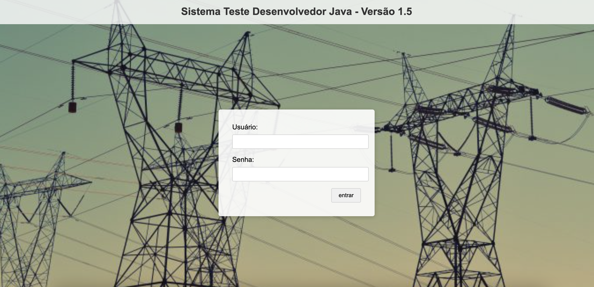
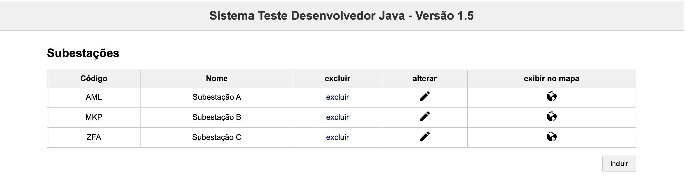

# ⚡ Gerenciador de Subestações Elétricas

Este projeto é uma aplicação web para **gerenciamento de subestações elétricas**, incluindo funcionalidades de autenticação, cadastro, edição, visualização e listagem de subestações e redes MT (média tensão).

A aplicação é composta por um **frontend em Vue 3 (Composition API + TypeScript)** e um **backend em Spring Boot** com segurança e documentação via Swagger.

<p align="center">
  
  
</p>

---

## 🚀 Tecnologias Utilizadas

### Frontend
- [Vue 3](https://vuejs.org/)
- [TypeScript](https://www.typescriptlang.org/)
- [Pinia](https://pinia.vuejs.org/)
- [Vue Router](https://router.vuejs.org/)
- [Axios](https://axios-http.com/)
- [PrimeVue](https://www.primefaces.org/primevue/)
- Composição via `*.vue` (Componentização)

---

## 🔧 Como rodar o projeto
📦 Requisitos
Node.js 18+

NPM ou Yarn

## 🌐 Frontend
```
cd frontend
npm install
npm run dev
```
A aplicação estará disponível em: http://localhost:8081

## 🖼️ Telas (Wireframes / Protótipos)
Login

Listagem de Subestações

Inclusão / Edição / Visualização

Confirmação de Exclusão